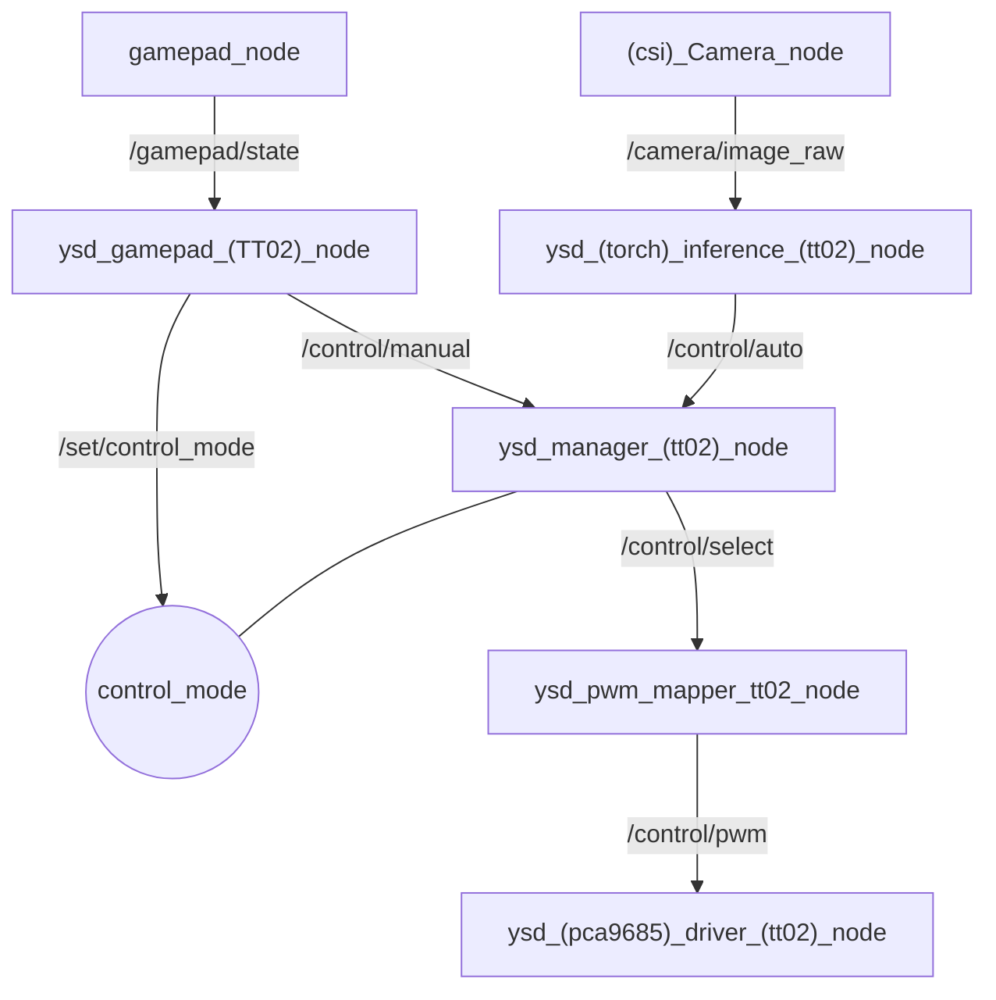
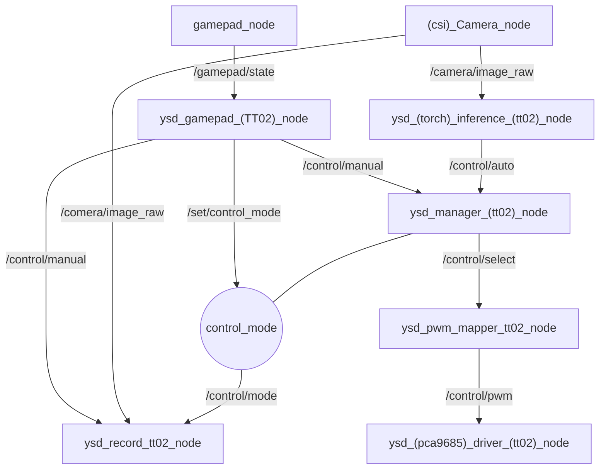

# Yoshida Smart Driver (YSD)

ROS2 を用いて RC カー (Tamiya TT-02 / 将来的に PIUS) を自律走行させるためのパッケージ群です。
DualSense ゲームパッドによる手動運転と、カメラ画像を入力とする PyTorch モデルによる自動運転を、
実行中に切り替えられる MUX 構成になっています。

## 特徴

- ゲームパッド (DualSense) による手動運転
- カメラ画像 (CSI カメラ) を入力とした PyTorch モデルによる自動運転
- 手動 / 自動をサービス呼び出し (`/set/control_mode`) で切り替え可能な Manager (MUX) ノード
- 正規化された操作信号 (`[-1.0, 1.0]`) を PCA9685 経由の PWM 信号にマッピングして実機を駆動
- `_tt02` サフィックスの命名規則により、車種依存のノードを増やすだけで他車種 (PIUS 等) に展開しやすい構成

## 対応ハードウェア

| 項目 | 内容 |
|---|---|
| 車両 | Tamiya TT-02 (対応済み) / PIUS (対応予定) |
| コントローラ | DualSense (Wireless Controller) |
| カメラ | CSI カメラ |
| PWM 出力 | PCA9685 (I2C) |
| 想定プラットフォーム | Jetson Orin Nano |
| OS | JetPack 6.2.1 |
| 実行環境 | Docker |
| ROS2 ディストリビューション | ROS2 Humble |

## アーキテクチャ
### ysd_bringup/ysd_auto_tt02.launch.py



- `ysd_gamepad_tt02_node` の L1 ボタンで手動 / 自動モードを切り替えます (`SetControlMode` サービス経由)。
- `ysd_manager_tt02_node` が MUX として、現在のモードに応じて `/control/manual` と `/control/auto` のどちらを流すかを選択します。

### ysd_bringup/ysd_collect_tt02.launch.py (未実装)



## パッケージ一覧

| パッケージ | 役割 |
|---|---|
| `gamepad` | ゲームパッドの生入力を読み取り `GamepadState` として送信する汎用パッケージ |
| `gamepad_msgs` | `GamepadState` / `GamepadAxisState` / `GamepadButtonState` メッセージ定義 |
| `camera` | CSI カメラからの画像取得・配信 (`csi_camera_node`)。動作確認用の `dummy_camera_node`、フレーム受信確認用の `frame_checker_node` を含む |
| `ysd_msgs` | YSD 固有のメッセージ・サービス定義 (`NormalizedDriveCommandTT02` 等) |
| `ysd_gamepad` | `GamepadState` を YSD の正規化操作信号 (`NormalizedDriveCommandTT02`) に変換 (TT-02 用) |
| `ysd_machine_learning` | カメラ画像を入力に PyTorch モデルで推論し、自動運転の操作信号を生成 |
| `ysd_manager` | 手動 / 自動運転の MUX。モード切り替えサービスを提供 |
| `ysd_pwm_mapper` | 正規化信号 (`-1.0〜1.0`) を PWM パルス幅 (例: `1500〜2500`) にマッピング |
| `ysd_pwm_driver` | PCA9685 (I2C) を操作し実際に PWM を出力するハードウェアドライバ |
| `ysd_bringup` | 上記ノード群をまとめて起動する launch ファイルと設定 (`config/ysd_auto_tt02.yaml`) |

## 動作環境

- ROS2 Humble
- Python 3 (ROS2 同梱)
- 追加ライブラリ: `evdev`, `smbus2`, `opencv-python`, など (`rosdep` では解決されないため別途インストールが必要)
- 機械学習フレームワーク: 自分で使用するフレームワークをインストールしてコードを拡張してください.

## インストール

```bash
# ワークスペースの src に配置
mkdir -p ~/work/ros2_ws/src
cd ~/work/ros2_ws/src
git clone https://github.com/namazyak3/Yoshida-Smart-Driver.git .

# ROS2 依存関係の解決
cd ~/work/ros2_ws
rosdep install --from-paths src --ignore-src -r -y

# pip 依存関係 (rosdep 対象外, uv を使用)
uv pip install evdev smbus2 opencv-python

# ビルド
colcon build --symlink-install
source install/setup.bash
```

## 使い方

```bash
ros2 launch ysd_bringup ysd_auto_tt02.launch.py
```

起動すると、手動運転 (デフォルト) の状態で待機します。DualSense を接続した状態で以下のように操作します
(キー割り当ては `config/ysd_auto_tt02.yaml` の `ysd_gamepad.keybind` で変更可能)。

| 操作 | デフォルト割り当て |
|---|---|
| ステアリング | 右スティック X 軸 (`rx`) |
| スロットル | 左スティック Y 軸 (`ly`) |
| 手動 / 自動 切り替え | L1 |
| 記録モード切り替え (予定) | R1 |

## 主要トピック / サービス

| 名前 | 型 | 説明 |
|---|---|---|
| `/gamepad/state` | `gamepad_msgs/GamepadState` | ゲームパッドの生状態 |
| `/camera/image_raw` | `sensor_msgs/Image` | カメラ画像 |
| `/control/manual` | `ysd_msgs/NormalizedDriveCommandTT02` | 手動運転の操作信号 |
| `/control/auto` | `ysd_msgs/NormalizedDriveCommandTT02` | 自動運転 (推論) の操作信号 |
| `/control/select` | `ysd_msgs/NormalizedDriveCommandTT02` | MUX が選択した操作信号 |
| `/control/mode` | `std_msgs/String` | 現在の制御モード (`manual` / `auto`) |
| `/control_pwm` | `ysd_msgs/PWMDriveCommandTT02` | PWM に変換後の操作信号 |
| `/set/control_mode` | `ysd_msgs/SetControlMode` (service) | 制御モードの切り替え要求 |

## 設定ファイル

`ysd_bringup/config/ysd_auto_tt02.yaml` に、トピック名・ゲームパッドのキーバインド・PWM マッピング範囲・
PCA9685 の I2C バス番号やチャンネル番号など、実行時パラメータをまとめています。車体ごとの調整はまずこのファイルを確認してください。

## PIUS 対応について

現状は TT-02 向けの実装のみですが、`_tt02` サフィックスのノード (`ysd_gamepad_tt02_node` / `ysd_pwm_mapper_tt02_node` / `ysd_pca9685_driver_tt02_node` など) と対応する launch/config を車種ごとに追加する設計になっています。
PIUS 対応時は同様の構成で `_pius` 系のノードと `ysd_auto_pius.launch.py` を追加することで、既存の `ysd_manager` や `ysd_msgs` など車種非依存の部分はそのまま流用できる見込みです。

## TODO

- 推論部分の構築  (自身が使用する推論モデルの入出力に合わせてください)
- 各パッケージの `package.xml` / `setup.py` の `description` と `license` が未記入 (`TODO: Package description` のまま)
